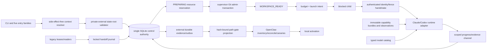
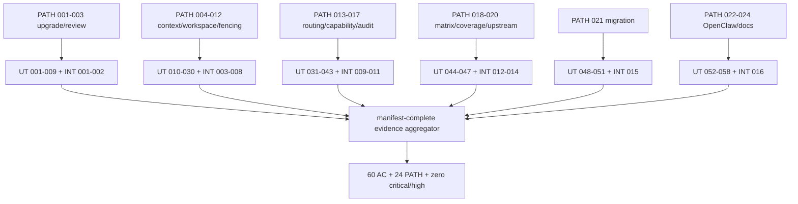

# /autoplan Engineering Review

Date: 2026-09-12  
Target: `specs/014-parallel-host-parity/plan.md`  
Phase order: CEO complete → Design skipped (CLI-only) → Engineering complete  
Voices: Claude Opus 5, high effort, read-only; Codex GPT-5.6 Sol, high effort, read-only artifact snapshot

## Scope assessment

The plan retains all five operator-requested slices: upgrade/install containment, parallel authority and workspaces, native Claude/Codex parity, whole-FFS audit and strict verification, and migration/OpenClaw activation. Locked acceptance remains unchanged: all 60 ACs and 24 PATHs, actual full-production-corpus line coverage at least 80%, 25 repetitions for each contested/fault row per platform, six 600-second pairing/platform soaks, real authenticated host evidence, safe M8 handoff, and zero open critical/high findings at final readiness.

Both voices found the design direction viable but requested plan changes. Claude scored the pre-repair plan 6.0/10; Codex scored it 5.8/10. The engineering adjudication accepts the findings below as planning requirements. Unfinished source repairs block their affected launch paths, while M3–M6 work may proceed in isolated fixtures after M2 review/adjudication. Plan approval does not mark runtime evidence PASS.

## Premises and current-tree corrections

| Premise | Evidence | Disposition |
| --- | --- | --- |
| M0–M2 can invoke the prospective verification runner before M7 | `scripts/verification/parallel_host_parity.py` is absent and the plan deferred scaffolding until after M2 | Accepted critical: add M-1 read-only bootstrap modes before M0 |
| `lib/host_capabilities.py` is wholly prospective | The file exists and is wired into the runner/installer, but is Codex-specific | Accepted high: treat it as existing repair surface; generic manifest/runtime architecture remains M5 |
| Current Codex runtime observation can admit a bundle | Current validator requires v1 `observed`; current observer emits v2 `derived`, and the runner requires the observation before a compatible producer path | Accepted high: exact schema/oracle/producer ordering is an M1a affected-path blocker and M5 hardening item |
| Coverage command is executable | Pytest-cov 7.1 performs its own combine; a direct proof showed the following `coverage combine` exits `No data to combine` | Accepted critical: use the pytest-cov combined file directly; separately test direct Coverage.py shard semantics |
| Historical 76.12%/54.70% was repository coverage | XML included tests and omitted unexecuted production; 57.06%/52.42% covers only 22 measured production modules | Corrected: no valid full-corpus baseline exists; final strict XML line gate remains 80% |
| Baseline Bats is only generally non-green | The isolated old `<0.148` expectation currently fails at `tests/bats/gsd-run.bats:1018–1023` | Accepted high: explicit M-1/M1a regression owner and gate |
| Worker writable roots already match the contract | Current runner grants primary `.feature-fix-swarm` and Git-common subtrees | Accepted high: M4 must re-anchor state and mediate/narrow Git writes before effective M5 admission |
| Context/evidence envelopes are complete | Run-context sample omits `repository_id` and `recovery_action`; gate vector lacks a persisted schema | Accepted high: add typed fields and derived, hash-bound gate projection contract |

## Existing code and integration seams

| Existing seam | Reuse | Required boundary |
| --- | --- | --- |
| `lib/run_state/state.py`, `lib/run_state/cli.py` | Durable run records and CLI compatibility | Extend by migration into one control authority; characterize old schema first |
| `scripts/coord/coord.py`, `lib/gates.py` | Stable façade commands, locks, findings/evidence concepts | Delegate mutations to the single authority; no second writer/store |
| `scripts/gsd/gsd-run.sh` | Host selection, run tuple, workspace and lifecycle integration | Shared runner edits serialize; context/workspace precede writes; worker roots become least privilege |
| `scripts/gsd/takeover-*.py` | PID/start/boot/process identity donors | Port a single canonical identity probe; permission uncertainty maps to UNKNOWN |
| `lib/host_capabilities.py` | Current Codex CLI/runtime validator | Align versioned observation schema, bounded calls, exact tuple and root-shape checks |
| `scripts/gsd/codex-runtime-observer.py`, `codex-runtime-bundle.py` | Bundle/canary evidence foundations | Immutable bundle, per-attempt logs, atomic private output, real shell/native/auth/hook oracles |
| `lib/model_requests.py`, `lib/dispatch.py` | Typed tier/exact routing | Bind catalog hash; exact vendor requests never silently substitute |
| `scripts/gsd/sync-codex-auth.py` | Serialized credential merge seam | Preserve losing rotated generation until reconciliation succeeds |
| `lib/ffs_installer.py` | Manifest/backup/rollback/doctor primitives | Own complete installed surfaces and retire obsolete compatibility text |
| `tests/coverage-parallel.ini` | Full-tree source discovery, subprocess patch, namespace reporting | One release workflow; exact production inventory and XML denominator checks |
| rollout/drift helpers and installer manifests | Consumer reconciliation donors | Full ownership/fork manifest supplements partial drift warnings |

## Architecture

Required edges made explicit by review:

- M-1 bootstrap modes precede M0; the full matrix implementation remains M7.
- SQLite reservation and Git creation use PREPARING/READY/ABORTED states and manifest-scoped compensation; they are not described as one cross-system transaction.
- M5 adapter work may run beside M3/M4, but effective host admission depends on M4’s final workspace and writable-root boundary.
- Child IPC names endpoint permissions, nonce/generation binding, reconnect ownership, replay denial, and the proxy/non-revocable boundary that closes check-then-act races.
- Active runs durably reference old bundles; credential, binary, config, policy, catalog, host-version, platform or source changes invalidate exact dependent evidence.
- M8 handoff holds an old-writer-compatible lease/interlock through epoch activation and proves an old runtime cannot restart a writer.
- M8 canonical consumer adaptations loop back through affected M6/M7 evidence before activation.

## Code quality, security, and recovery

The proposed narrow Python modules are preferable to enlarging `gsd-run.sh` and `gates.py`. Shared invariants must have one implementation: repository/objective identity, run-ID validation, process identity, runtime-tree hashing, state-root resolution, and gate projection. Shell remains a thin façade.

The worker boundary is enforceable only after the runner stops passing primary-state and blanket Git-common roots. Required Git mutations become supervisor operations or narrowly enumerated per-worktree administrative roots whose shape is independently checked. Runtime/evidence paths reject symlink ancestors, foreign ownership, unsafe modes, non-local/unhealthy storage and inadequate capacity. Capability probes use bounded argument arrays; evidence uses per-attempt private files, atomic rename and fsync. Shell denial and native-tool denial are separate observed outcomes.

Recovery distinguishes `legacy_writer_reinstated` from `paused_incompatible`; a generic `compatible_writer_selected` state is insufficient. LIVE and UNKNOWN owners refuse takeover. A surviving child reconnects only through the fenced protocol. Budget/event idempotency prevents a replay from purchasing another host invocation. Failures after DB reservation or worktree creation follow journaled compensation and never remove an unowned path.

## Test coverage diagram

The M4 command must select only INT-003–008; later integration cases receive phase markers or separate files. Add negative cases for state-root shape/health, repository identity through symlink/case/linked worktrees, both DB/Git partial orders, IPC spoof/replay/reconnect, revocation between check and effect, primary/Git-common writable roots, TOML-special paths, concurrent immutable canaries, wrong-schema or nonzero observations, native versus shell denial, lost credential rotation, missing coverage modules/shards, old writer restart, and OpenClaw self-comparison/consumer-skill overwrite.

## Performance and verification budget

At minimum, three contested identities plus eight named fault families produce `11 × 25 × 2 = 550` deterministic row executions and more than 1,100 process launches. Six authenticated soak rows consume 60 pairing-minutes and about 120 host-process minutes. Expected final wall time is roughly 75–150 minutes with platform/row parallelism; serial contingency is 3–5 hours.

The runner exposes `--shard i/n`, a per-iteration deadline, a per-row deadline and a quota/auth precondition. Each row records all 25 executions; a failed attempt is not retried into PASS. Each soak job has a 720–750 second outer deadline while requiring 600 seconds of measured overlap. Serialize only repository Git administration, profile activation, credential synchronization, candidate freeze, legacy cutover and OpenClaw activation.

## Error and rescue registry

| Failure | Detection | Rescue | Residual risk |
| --- | --- | --- | --- |
| State root unsafe/full/corrupt | ancestor `lstat`, uid/mode/local-FS/capacity probe, integrity/schema check | freeze mutations; retain safe diagnostic; restore verified backup to a new root | final local diagnostic may fail on full disk |
| DB/worktree partial order | PREPARING journal plus exact path/common-dir manifest | mark ABORTED and compensate only owned artifacts under Git admin lock | manual Git corruption may require quarantine |
| LIVE/UNKNOWN owner | full PID/start/boot identity | refuse; inspect or wait; never infer death from age | UNKNOWN can block indefinitely by design |
| supervisor/child split | authenticated endpoint, acknowledgement and reconnect record | reattach fenced child or prove death | host invocation idempotency can remain external |
| stale/revoked fence | transactional generation check/proxy boundary | reject event/effect; retain attempt evidence | direct external effects require non-revocable state |
| capability drift or failed canary | exact tuple hashes, expiry, exit status and observed events | keep old bundle; recertify exact tuple | opaque managed-host policy |
| credential rotation race | serialized compare-and-swap plus preserved losing copy | merge/retry before deleting runtime | provider-side token invalidation |
| empty/stale/wrong review | schema, nonempty content, frozen-manifest hash and provenance | keep path blocked; rerun distinct reviewer | reviewer availability |
| missing coverage data | exact 34+ dynamic production inventory versus XML and worker manifest | rerun full candidate collection | auto-combine hides raw shard provenance unless captured |
| migration interruption | legacy lock, journal and writer sentinel | resume idempotently or reinstate proven compatible legacy writer; otherwise pause | old binaries require compatibility interlock |
| OpenClaw fork mismatch | ownership/hash/fork inventory | refuse activation; port canonical adaptation back through M6/M7 | late consumer change invalidates evidence |

## Independent voices

### Claude Opus 5

Verdict before plan repair: **REQUEST CHANGES, 6.0/10**. It identified stale current-tree inventory, the missing runtime-observation producer contract, the M0 prospective-command cycle, broad primary/Git writable roots, run-context schema drift, redundant coverage combine, unsized coverage uplift, unsharded matrix runtime, ambiguous rollback state, missing persisted gate-vector schema, weak root-shape validation, obsolete support-range documentation, sanitizer retirement ambiguity and conditional hook-trust bypass.

### Codex GPT-5.6 Sol high

Verdict before plan repair: **REQUEST CHANGES, 5.8/10**. It independently confirmed the verification bootstrap cycle, broken coverage lifecycle, current Codex observation incompatibility, broad writable roots, incomplete context/gate schemas, workspace compensation and IPC/fencing gaps, M4 integration contamination, unsafe legacy cutover, stale coverage/Bats premises, missing invalidation projection and the M4 dependency for effective M5 admission.

## Consensus and adjudication

| Topic | Claude | Codex | Decision |
| --- | --- | --- | --- |
| All five slices and strict final gates | Keep | Keep | Accepted unchanged |
| Bootstrap verifier | Separate existing commands from prospective M0 capture | Add M-1 modes before M0 | Add M-1 bootstrap; M0 never treats absence as no-op |
| Codex admission | Observation producer missing/incompatible | Observation structurally impossible/unsafe | Assign exact M1a blocker and M5 hardening; affected launch remains unadmitted |
| Coverage | Remove double combine; size uplift | Same; prove exact denominator | Use pytest-cov output directly, module inventory/floors/owners and midphase checkpoint |
| Workspace security | Re-anchor primary state and narrow Git roots | Supervisor-mediate broad roots | Accepted in M4; effective M5 admission waits |
| Context/gate schemas | Add missing fields/vector | Derived, hash-bound projections | Add repository/recovery/idempotency and gate projection requirements |
| Matrix runtime | shard/deadline/quota | shard by row/platform | Accepted without reducing 25/600 bounds |
| Migration | split rollback outcomes | legacy-compatible interlock through epoch | Both accepted |
| OpenClaw | early inventory/source freeze | feedback loop to M6/M7 | Already accepted and retained |

No voice-proposed reduction to coverage, repetitions, soak duration, real-host proof, M8 activation or product slices is accepted.

## Engineering implementation tasks

1. **ENG-001 P0 — Plan/contracts owner:** add M-1 baseline/install/upgrade/review harness bootstrap and correct stale inventory/coverage premise. Blocks M0.
2. **ENG-002 P0 — Host prerequisite owner:** close current Bats ceiling regression and align observation producer/consumer ordering and schema. Blocks affected Codex launch.
3. **ENG-003 P0 — Coverage owner:** make the pytest-cov workflow executable, verify XML inventory equals all production files, assign per-module uplift owners and a midpoint checkpoint. Blocks M7/M8.
4. **ENG-004 P0 — State authority owner:** specify canonical repository/objective/idempotency identities, private state-root validation and append-only gate projections. Blocks M3–M8.
5. **ENG-005 P0 — Workspace/supervisor owner:** implement PREPARING/READY/ABORTED compensation, authenticated reconnectable IPC and check/effect fencing. Blocks PATH-004–012.
6. **ENG-006 P0 — Sandbox/host owner:** remove primary-state and blanket Git-common worker grants, then bind live capability admission to the final M4 root policy. Blocks PATH-015/016.
7. **ENG-007 P0 — Capability owner:** immutable versioned bundles/observations, real shell/native/auth/hook/skill oracles, expiry/invalidation and old-bundle references. Blocks M5 admission.
8. **ENG-008 P1 — Independent test architect:** split phase integration collection, add fault cases and manifest every matrix row/seed/platform/deadline/provenance. Blocks M4/M7 claims.
9. **ENG-009 P1 — Verification performance owner:** implement row/platform sharding and deadlines while preserving 25 repetitions and six 600-second soaks.
10. **ENG-010 P0 — Migration owner:** hold a legacy-compatible interlock through epoch activation and test `legacy_writer_reinstated` and `paused_incompatible`. Blocks M8a.
11. **ENG-011 P1 — OpenClaw owner:** complete early inventory and feed canonical adaptations through candidate freeze and affected M6/M7 reruns. Blocks M8b.
12. **ENG-012 P0 — Producer-distinct readiness reviewer:** require all 60 ACs/24 PATHs, strict full-corpus line ≥80, six soaks, 25 executions per row and zero open critical/high before activation.

## Completion

All critical/high engineering findings above are converted into explicit plan dependencies, implementation ownership and acceptance evidence. They are therefore closed as **plan defects**. Their runtime gates remain UNMET until implementation evidence passes. Engineering phase disposition after accepted edits: **APPROVE FOR IMPLEMENTATION IN THE DOCUMENTED PHASES**.
