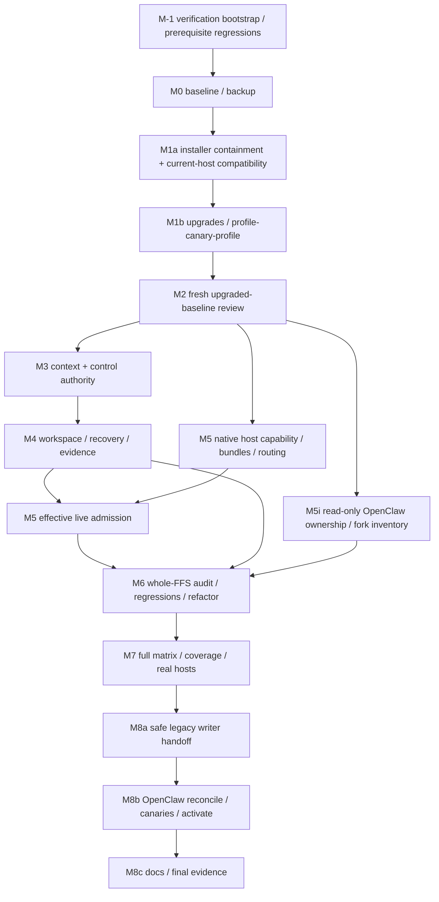

## September 14 recovery continuation

The selected qualification target is now GSD 1.14.0 at
`f8542fef67c1f978ffa70912cb6f2aaab76464c6`. The original requirements remain
in force; current evidence and remaining work are mapped in
[the recovery continuation](recovery-20260914.md). Historical 1.13 results
below do not certify the new source/runtime closure. Production readiness
and default activation remain unmet.

## AD-016 sequencing amendment (2026-09-12)

The authoritative amendment is [AD-016](../../docs/upgrades/2026-09-12-ad016-current-reference.md) (repository path `docs/upgrades/2026-09-12-ad016-current-reference.md`). It supersedes conflicting historical-completeness prerequisites below. The eight sealed historical gaps remain UNMET; `full_baseline_complete` and historical comparison PASS are not redefined or asserted. Captured original facts remain mandatory comparison evidence. After terminal upgrade decisions and complete current observations, a separately labeled observed-upgraded-reference may be frozen for fresh M2 review. No concurrency source precedes M2; no final readiness, security, coverage or authenticated gate is waived. See the sealed `docs/upgrades/2026-09-12-historical-audit-limitations.json` enumeration.

<!-- /autoplan restore point: /Users/luminamao/.gstack/projects/feature-fix-swarm/014-parallel-host-parity-autoplan-restore-20260912-130604.md -->
# Implementation Plan: FFS Upgrades, Parallel Runs, and Host Parity

**Branch**: `014-parallel-host-parity` | **Date**: 2026-09-12 | **Spec**: [spec.md](spec.md)

**Input**: `/Users/luminamao/Documents/Github/feature-fix-swarm-runs/upgrade-parallel-20260912/specs/014-parallel-host-parity/spec.md`

**Canonical source**: `docs/plans/2026-09-12-ffs-parallel-host-parity.md`, SHA-256 `a7f38056a36e8e5ae5a00697784d71ef92c16d614f832a4f396ce6a6aaa26889`; original operator SHA-256 `6eff15ae24b33c475f34e4d5592da18674c694ee560c6f0d652ad1b36a19eb59`.

**Planning status**: Design complete subject to normal independent plan review; execution gates below are not claimed PASS. All five slices, 60 FR/AC pairs, and 24 CLI paths retained.

## Summary

Repair and prove managed installation containment before completing upgrades. Require a fresh review of the upgraded baseline before writing concurrency code. Extend the existing Python/Bash FFS with one supervisor-owned durable run/activity/attempt authority, selected-input worktrees prepared before planning, fenced child-start recovery, external evidence, native host capability/runtime contracts, and behavior-preserving resolver consolidation. Prove the full verification matrix, then safely hand off legacy ownership and reconcile OpenClaw from a complete ownership/hash/fork manifest before local activation.

Prior-art decision: **port narrow primitives, wrap local executors, build missing FFS durability semantics**, as adjudicated in [prior-art.md](prior-art.md). Reuse Git/GSD/stdlib SQLite and current dependency declarations; do not adopt another orchestrator. [research.md](research.md) records evidence, alternatives, and remaining empirical gates.

## Technical Context

**Language/Version**: Existing Python 3.11-compatible modules and Bash scripts; Node >=24/npm >=10 for pinned upstream installer. Verify exact active interpreter/tool identities in the upgrade ledger.

**Primary Dependencies**: `@opengsd/gsd-core` 1.13.0; current `requirements-dev.txt` (pytest, pytest-cov, Bandit, filelock>=3.30,<4); installed Claude/Codex; Git. No new runtime dependency. Refresh supported resolved dependencies without altering direct declarations or forcing transitive ranges.

**Storage**: Extend SQLite RunStore to one supervisor-owned control database in a validated private local state root outside all repositories; durable evidence under that root by run/activity/attempt. Legacy SQLite/JSON stores remain preserved and dual-read until M8. Short SQLite transactions; anchored atomic/fsync manifests; short Git/install/credential locks.

**Testing**: Existing pytest, Bats, shellcheck, Bandit, skill/host/model/environment checks; independently authored regression/race tests; CLI E2E; separate authenticated real-host canaries. No browser stack.

**Target Platform**: Operator-scoped local macOS and Ubuntu, including existing Ubuntu Python3.11/Node24 CI. No network-filesystem or distributed-machine lock claim.

**Project Type**: Python/Bash CLI and installed skill/runtime tooling with consumer vendoring.

**Performance Goals**: At least two overlapping runs; all three host pairings. Exactly-one contested owner, no budget replenishment, no sibling corruption. No long lock around agent work. Deterministic 25 repetitions per contested race/fault variant/platform plus a 10-minute bounded soak per host pairing/platform; reduce repetitions only through documented test-plan change, not to hide failures. Host calls have configured bounded timeouts and cannot hang for prompts.

**Constraints**: No primary-checkout planning/source writes; no real-repository commits on any branch, pushes, releases, tenant deployment, discarded work, or unrelated cleanup. Fixture commits only in separate disposable repositories. Running sessions are neither waited out nor terminated for upgrades. Missing auth/platform/evidence is an unmet gate, never PASS.

**Scale/Scope**: Five original slices, M0–M8; 12 stories/60 requirements/24 paths; both shared profiles, tool managers/customizations, all FFS entry families, complete OpenClaw tooling rollout and docs.

## Constitution Check

Read `.specify/memory/constitution.md` version1.0.0. It describes the upstream Spec Kit/`specify-cli` package (Typer registries, integration subclasses, `src/`, Windows matrix), while this checkout is FFS Python/Bash and the operator explicitly scopes macOS/Ubuntu. Apply safety/test/idempotency/CLI principles; do not fabricate a Typer migration or silently widen scope. This is applicability reconciliation, not a new approval request or a constitution edit.

| Principle/gate | Pre-research disposition | Post-design disposition |
| --- | --- | --- |
| Layered logic, one source of truth | Existing CLI/library split identified | PASS-DESIGN: new importable context/ownership/workspace/host modules; existing façades delegate |
| Test-backed behavioral changes | Existing pytest/Bats baseline read | PASS-DESIGN: RED-first map, independent acceptance authors, full hermetic + real-host gates; execution still unmet |
| CLI consistency/JSON | Existing syntax retained | PASS-DESIGN: machine JSON stdout, diagnostics stderr, typed exits; additive selection/resume |
| Offline/resource discipline | Core local operations stay local | PASS-DESIGN: network only explicit upgrade/host probes; bounded calls; offline fixtures |
| Minimal dependencies/safe files | Reuse stdlib/declarations | PASS-DESIGN: no new dependency, anchored paths, manifest hashes, conditional rollback/idempotency |
| Cross-platform/security | User requires macOS/Ubuntu | PASS-DESIGN: both required matrices; foreign Spec Kit Windows/Typer specifics do not describe this product |
| Workflow/authority | Explicit no-commit restriction | PASS-DESIGN: no commit/push/release/PR auto-publication; existing branch retained |

Runtime readiness is not conferred by PASS-DESIGN. Any proven safety invariant violation blocks its phase.

## Project Structure

### Documentation (this feature)

```text
specs/014-parallel-host-parity/
  spec.md, socratic.md, prior-art.md
  plan.md, research.md, data-model.md, quickstart.md
  contracts/run-context.md
  contracts/host-capabilities.md
  contracts/installation-rollout.md
  contracts/verification.md
```

No tasks.md, `.planning` decomposition, source implementation, or test implementation is authored in this planning phase.

### Source Code (repository root)

Existing modules to extend: `lib/ffs_installer.py`, `lib/run_state/state.py`, `lib/run_state/cli.py`, `lib/gates.py`, `lib/model_requests.py`, `lib/dispatch.py`, `scripts/coord/coord.py`; runner/lock/recovery/wall/finalizer/bundle/auth/model scripts under `scripts/gsd`; `skills/feature-spec`, `feature-implement`, `feature`, `fix`, `code-uplift`; `templates/model-requests.json`; `setup.sh`; schemas/docs/CI.

Existing prerequisite repair surfaces also include `lib/host_capabilities.py` and `scripts/gsd/codex-runtime-observer.py`; their current producer/consumer contract is not admitted until M1a evidence passes. Prospective modules (not yet present): `lib/run_context.py`, `lib/process_identity.py`, `lib/run_state/ownership.py`, `lib/run_state/workspace.py`, `lib/run_state/supervisor.py`, `lib/run_state/migration.py`, `lib/runtime_bundle.py`, `lib/installation_layout.py`, `lib/rollout_manifest.py`; `templates/host-capabilities.json`; `scripts/verification/parallel_host_parity.py`; focused tests listed below.

**Structure Decision**: Reuse current packaging and thin CLI wrappers. New modules hold narrow state/path/identity/host invariants rather than enlarging `gsd-run.sh` or `gates.py`. Root `lib/runtime_proof.py` is browser-specific today: do not weaken its browser contract to fabricate CLI proof; the prospective verification runner uses a separate CLI proof schema.

## Dependency DAG and implementation phases



If GSD1.12/1.13 requires new compatibility readers, a narrowly scoped reader-only prerequisite is part of M1a; it cannot enable new writers or steal ownership. Current fixture evidence reports readable 1.11 planning state, so no format incompatibility is assumed. New authority code operates only on fixtures before M8; production old/new writers never coexist.

| Phase | Concrete work and file ownership boundary | Exit evidence / dependencies |
| --- | --- | --- |
| M-1 | Independent verification owner creates only the read-only `baseline`, `installation`, `upgrade`, and `review` runner modes and their schemas before M0; host-prerequisite tester owns the exact retired-version-ceiling regression. These modes inspect/aggregate actual commands and artifacts without implementing concurrency. Publish their help/output/exit taxonomy first: legitimate UNMET is distinct from FAIL and runner crash. | Commands exist, reject missing/empty/malformed output, write atomically to private external evidence, and make no real repository commit/push/release or activation. The isolated Bats expectation at `tests/bats/gsd-run.bats:1018–1023` is updated through a regression test. |
| M0 | Supervisor owns `docs/upgrades/*` and private external baseline/backup manifests. Record Git state/worktrees, origin/main local/CI comparison, full suites/coverage, canonical source/bytes, tool/customization inventories. | Actual failures and backups attributable. Historical Python1330pass/5fail and incomplete macOS Bats990pass/1fail (no completed suite result) are recorded. The prior76.12% line/54.70% branch XML included test modules and omitted unexecuted production modules; the filtered22-module reconstruction (4765/8351 lines,1708/3258 branches) is diagnostic only. No valid full-production-corpus percentage exists until the corrected final-environment run. |
| M1a | Installer worker: `lib/ffs_installer.py`, new `lib/installation_layout.py`, `tests/fixtures/gsd-installer-stub.py`, fixture stage helpers. Host prerequisite worker repairs existing `lib/host_capabilities.py` plus the existing observation producer, adds the versioned manifest, and aligns doctor/runner compatibility consumers. Independent tester owns regression files. | Prove private stage catches external shared skills, emitted/transitive runtime refs, hash-guarded rollback and canary ordering. Codex0.154 behavior proof, not ceiling-only change. Snapshot mixed12old/60staged skills; do not guess old bytes. No concurrency code. |
| M1b | Supervisor executes managed upgrades through existing managers; records Node/npm ownership, gstack/Node patch ports and external skill pins. Installation lock covers short activation only; no session wait/kill. | Profile→canary→profile complete, suite comparison, ledger, and one frozen content-addressed reference manifest covering source, lockfile, installed runtime/bundle, configuration/policy, dependency and test-environment identities. Already recorded gh2.92→2.96, tmux3.6a→3.7b, coreutils9.10→9.11, required libevent2.1.12_1→2.1.13 with552-file backup/old kegs/linkage/tmux canary. GSD activation now verified1.13 both hosts (Claude866/Codex868 hashes,72 shared skills reconciled,59 prior divergent skill bytes preserved). Python Playwright1.62/pytest9.1.1/cov7.1/filelock3.32.6 upgraded; real Chromium151 DOM canary passed. npm refresh12existing+1nested lock entry, npm ci105/packages tree/audit0 passed. These component results do not establish the full M1 suite or host gate. |
| M2 | Independent opposite-vendor artifact reviewer (fallback distinct model/degraded); review pipeline fixture owner tests empty output and severe finding refusal. | Fresh review of the exact frozen reference manifest; any material input hash change invalidates the affected review. Findings record affected paths and four separate states: review complete, repair authorized, path admitted, rollout ready. Max2fix rounds/set precede escalation/adjudication, never abandonment or waiver. Close upgrade/admission prerequisites; classify accepted M3–M6 findings with owner/regression/phase as still rollout-blocking. Review completion authorizes planned isolated repairs only; it cannot set path-admitted or rollout-ready. No concurrency code precedes this review/adjudication. |
| M3 | Context/state worker: new context, identity, ownership modules; RunStore schema/CLI; coord/gates façades; manifest additions. First deliver a vertical proof for one run/activity, transactional triple reservation, one fenced child, restart recovery and legacy read compatibility. Persist `PREPARING`, `WORKSPACE_READY`, and `ABORTED` compensation states around the separate Git transaction. | Shared resolver/validator, canonical repository/objective/idempotency identities, typed `repository_id`/`recovery_action`, durable generations/budgets, and a persisted append-only evidence schema whose four gate values are hash-bound derived projections. Legacy repository lease remains active until workspace-ready admission is enforced for every entry family. Test against isolated authority only. |
| M4 | Workspace/supervisor worker: workspace, supervisor, selected-input manifests; runner, wall, session-wake, reconcile, finalizer, lifecycle, status collectors and affected entry skills. Re-anchor coord/state away from the primary checkout and replace current primary `.feature-fix-swarm`/blanket Git-common worker grants with supervisor-mediated or independently shape-validated per-worktree roots. | Workspace ready before all activity writes; journaled compensation for both DB/Git partial orders; private authenticated/reconnectable IPC; replay and check-then-effect fence tests; no primary sync; distinct refs; external durable evidence; worker control denial. M4 collects only INT-003–008, never later phase tests. |
| M5 | Host worker: shared runtime builder, capability manifest, existing Codex wrapper/auth sync, strict Claude adapter, model catalog/loaders/shell adapters and installed skill routing. | Actual installed host hooks/sandbox/skills/routing/auth; exact requests/native tiers; immutable tuples; strict-tool denials; ownership/reviewer separation. Capability results declare expiry/invalidation triggers for executable, bundle, config, policy, model-catalog, host-version and platform changes; referenced old bundles remain recoverable. Pure adapter work can proceed beside M3/M4 after M2 with disjoint files, but effective live admission depends on M4's final workspace/root boundary. Changes to shared runner/gates serialize by assigned owner. |
| M5i | Consumer worker performs read-only OpenClaw ownership/hash/fork inventory before the M6 source freeze; no activation or consumer mutation. | Every observed fork is classified as consumer-only, canonical adaptation required, or unresolved. Canonical adaptations enter M6 with regression ownership. |
| M6 | Whole-FFS code-uplift findings owner → independent regression author → implementation fixes → five-family resolver refactor owner → fresh verifier. Extend the M-1 runner with later audit/matrix modes only after M2 and cover the refactor before candidate freeze. | Zero confirmed critical/high, every medium/low disposition+owner, preserved behavior and re-pinned review command if changed. Build a per-module production inventory with line/branch gaps, owners and floors, and run a midpoint full-corpus checkpoint before candidate freeze. Freeze a content-addressed FFS candidate; any later canonical edit invalidates affected M6/M7 evidence. |
| M7 | Acceptance/verification worker: extend the bootstrapped verification runner with race/security/lifecycle/CLI modes, CI platform matrix, corrected full-corpus coverage config/report, safety-critical branch/state oracles and authenticated evidence. The matrix exposes `--shard i/n`, per-operation/iteration/row deadlines and a quota/auth precondition while preserving every execution. Publish minimum recovery/rollback/abort/ownership/evidence runbooks before activation. | Full automated/real-host matrix green on macOS/Ubuntu, actual full-production-corpus line≥80 with branch reported separately, every safety-critical refusal/recovery transition covered, issue#4588 measured, no empty gate. Unavailable auth/platform stays unmet. |
| M8a | Migration worker: readers/journal/writer-epoch handshake and rollback in migration module + existing legacy façades; supervisor executes real handoff using the pre-activation runbooks. Hold an interlock understood by the legacy writer across epoch activation and block old-runtime restart. Public supervisor-owned administrative verbs cover nonmutating `migrate plan/status` plus `handoff`, `resume`, `abort`, and `rollback`; tests use the same surface. | Real-state dual-read, live leases untouched, released/proven-dead handoff, idempotent import/quarantine, interruption drill, explicit `legacy_writer_reinstated` and `paused_incompatible` rollback outcomes, no mixed writers. |
| M8b | Consumer worker: rollout manifest/installer reconcile, canonical FFS adaptation tests, explicit-source drift helper. Supervisor owns isolated OpenClaw integration and public `rollout dry-run/status/local-activate/rollback` verbs; verification modes remain nonmutating. | Every fork adjudicated, all named package/wrapper/pin/helper/library/schema/host surfaces hashed, consumer skill trees preserved, bytes match canonical, repeated both-host concurrent canaries before activation. A canonical FFS edit returns to affected M6/M7 gates; stale evidence cannot activate. |
| M8c | Documentation worker: README/docs/skills/examples plus required OpenClaw repo guidance only. Supervisor final evidence index; operational runbooks already exist from M7 and are reconciled here. Separate the implementation handoff from an operator quickstart; define supported prerequisites and `rtk`, root configuration/doctor, a disposable hello-world, CLI/exit/error reference, glossary, support bundle and measured TTHW. | Every requested topic/claim corrected from the current ledger, superseded baselines labeled, user-global layer unchanged, authorization/history/workspace checks, all60AC proven; changes remain uncommitted. |

## Current review and upgrade disposition

The [upgraded-baseline review](../../docs/upgrades/2026-09-12-upgraded-baseline-review.md) exists and reports B1 workspace-before-writes, B2 permissive Codex config/native-network surfaces, B3 obsolete version ceiling, B4 frontier→Sol routing, B5 unproved hook trust/ambient discovery. These are confirmed review inputs requiring regression/fix or evidence-based refutation; none is declared resolved here. B3 plus the host admission portions of B2/B4/B5 are M1a prerequisites for using that automatic launcher. B1 is delivered by M3/M4, with remaining host isolation in M5. Its existence cannot create a dependency cycle that forbids implementing its own remedy after the required fresh review. Only reviewed isolated repair work may proceed while normal admission/rollout remains gated.

Parent adjudication explicitly distinguishes **review complete for planned repair** from **safe launcher admission** and **rollout PASS**. The two-fix-round limit triggers escalation/written adjudication; it does not end repair work or waive a confirmed critical/high. Final M6/M7/M8 readiness still requires zero such findings. The parent has synchronized this interpretation into canonical M2 and spec FR-010/AC-010/PATH-003. Original operator source remains immutable; canonical plan SHA-256 is `a7f38056a36e8e5ae5a00697784d71ef92c16d614f832a4f396ce6a6aaa26889`.

Latest [upgrade ledger](../../docs/upgrades/2026-09-12-upgrade-ledger.md) supersedes stale progress notes: profiles1.13 and above manager/Python/npm component checks are complete; upgraded full suite remains pending. Gbrain0.50.0.0 is staged while active0.47.6.0 remains because its required drain/stop-all-DB-workers cutover conflicts with no interruption. This is a concrete individual incompatibility, not success or permission to terminate workers; see [gbrain staging](../../docs/upgrades/2026-09-12-gbrain-staging.md). Node/npm/custom gstack remain under staged review. Existing unchanged OpenTelemetry/importlib-metadata conflict is recorded, not unsolicited cleanup.

[Codex capability evidence](../../docs/upgrades/2026-09-12-codex-capability-evidence.md) proves subscription Luna-low marker inference only. Three ambient malformed agent TOMLs and449 dropped skills appeared despite ignored user config; strict private-runtime discovery/hook/native-tool proof remains mandatory. Do not treat that marker as a GSD drive or capability-envelope PASS.

[Coverage correction](../../docs/upgrades/2026-09-12-coverage-correction.md) supersedes the historical76.12%/54.70% claim. Those XML files included13 test classes and only22 measured production classes. The filtered snapshot (4765/8351 lines=57.06%;1708/3258 branches=52.42%) is still not the full corpus. `tests/coverage-parallel.ini` discovers all first-party Python under `source = .`, including namespace packages, unexecuted modules, skill scripts and subprocess data, with no production exclusion. M7 retains a strict XML line-rate≥80 gate and reports branch rate separately.

## Implementation mechanisms

1. **Resolver before writes.** `resolve_context(request)` validates identities/aliases and inherited env without creating state. Supervisor obtains/creates canonical registration, reserves resources, prepares workspace, then binds upstream project/workstream/session context there. Entry skills call this preparation before specification seeding, walls, stateful preflight, or activity evidence. Existing source snippets selecting primary `.planning` are replaced, not duplicated behind another preference ladder.
2. **One authority.** Extend RunStore via schema migration, not a competing replacement library. The new control database owns runs, activities, attempts, resource ownership, grants, budgets, migration state, and audit outbox. `coord.py` and `gates.py` remain compatibility façades. During reader-only transition they never create a second writer; explicit epoch selects the sole authoritative protocol.
3. **Fenced subprocesses.** Atomic intent/debit before spawn; child waits for authenticated supervisor handshake and validated generation before host side effects. Reclaim requires DEAD/full identity; LIVE/UNKNOWN blocks. Event idempotency prevents token/debit replay. A crash after commit but before release signal is reconciled through committed state, not output age.
4. **Worker boundary.** Exact workspace/own evidence write roots, own Git worktree administrative files as needed, read-only runtime. No blanket Git-common-dir/state-root write permission. Git objects remain shared; document cooperative boundary. Supervisor owns registration/grants/landing/credential sync and validates fence on every authoritative operation.
5. **Runtime/capability contract.** Bound executable/version, host model/tier, bundle/config hashes, policy profile, and real capability result IDs. Exact-model unavailability fails. Shared model request catalog defines native tiers; fallback stops below frontier. Strict Claude controls settings, hooks, shell/native tools independently and preserves subscription auth through existing credentials without logged values.
6. **Migration/rollout.** Preserve legacy snapshots and source hashes; dual-read normalized views; short locked safe handoff; new writer epoch activation only when old owners released/dead. Conflicts quarantine. Rollback freezes writes, preserves new evidence, selects one compatible writer; never restore a snapshot over live/newer ownership. OpenClaw requires full manifest completeness in addition to drift check, whose current partial-install MISSING warnings alone cannot pass this rollout.
7. **Gate vector, never phase shorthand.** Each affected path records review completion, repair authorization, path admission and rollout readiness independently. M2 may set only the first two. Evidence is content-addressed, and any material source/runtime/configuration change invalidates the affected later states.
8. **Operational lifecycle.** Capability evidence has explicit recertification triggers and old-bundle retention. The external state root fails closed on capacity, permission, corruption or incompatible schema and exposes non-secret recovery evidence. Minimum operator runbooks precede activation.

## Requirement ownership and path traceability

Every FR has one primary delivery owner phase; cross-phase tests remain cumulative. Same-numbered AC is the acceptance contract.

| FRs (inclusive) | Primary phase | Required PATHs |
| --- | --- | --- |
| FR-001–FR-003 | M0 | PATH-001 |
| FR-004–FR-009 | M1a/M1b | PATH-001–PATH-002 |
| FR-010 | M2 | PATH-003 |
| FR-011–FR-015 | M3 | PATH-005–PATH-006 |
| FR-016–FR-019 | M4 | PATH-004–PATH-007 |
| FR-020–FR-022 | M3 | PATH-008–PATH-009, PATH-019 |
| FR-023 | M7 (M3–M5 contribute implementation) | PATH-008–PATH-009, PATH-019 |
| FR-024–FR-028 | M4 | PATH-010–PATH-012 |
| FR-029–FR-035 | M5 (FR-032 prerequisite subset M1a) | PATH-013–PATH-016 |
| FR-036–FR-038 | M6 | PATH-017 |
| FR-039–FR-047 | M7 | PATH-007–PATH-010, PATH-013–PATH-020 |
| FR-048–FR-050 | M8a | PATH-021 |
| FR-051–FR-055 | M8b | PATH-022–PATH-023 |
| FR-056–FR-058 | M8c | PATH-024 |
| FR-059–FR-060 | All phases; final owner M8c | PATH-001, PATH-003, PATH-024 |

## Complexity Tracking

| Applicability/complexity decision | Why needed | Simpler alternative rejected |
| --- | --- | --- |
| Imported Spec Kit Typer/Windows/branch rules do not describe FFS | Preserve operator's actual existing Python/Bash product and macOS/Ubuntu scope | Rewriting CLI/framework or adding foreign matrix is unrelated scope; applicable tests/security/JSON rules remain binding |
| One extended SQLite authority plus retained legacy readers | Atomically reserve three resources, fence grants/budgets, and safely migrate | More independent JSON control stores require unsafe cross-store writes |
| Intent/acknowledgement and explicit writer epoch | Prevent crash duplicates and mixed writers | Spawn-then-record or TTL-only takeover violates required invariants |
| Provider agent-context script absent | v1.0.6 lacks optional extension; setup-plan already ran once | Fabricated script or unsolicited context-file edits are unsupported; record context here/quickstart, no auto-commit |

## Unit Test List

Anticipated cases in design-criticality order. Acceptance author and implementation owner must differ; regression tests are established RED before the corresponding change. These are prospective cases, not tests already written or passed. Unit cases isolate pure decisions; integration/race paths below prove actual subprocess/filesystem effects without mocking the function under test.

1. **UT-001**: Runtime layout maps every Codex skill destination outside config-dir correctly and rejects escape/unverified symlink destinations.
2. **UT-002**: Snapshot/rollback preserves unowned and concurrently modified files; manifest hash mismatch refuses overwrite.
3. **UT-003**: Private stage process/filesystem mapping confines all emitted paths; source-catalog references differ from emitted/transitively executed runtime leaks.
4. **UT-004**: First-profile canary failure prevents second-profile activation and retains exact pre-flip runtime evidence; verified intentional profile-root symlinks retain pinned targets.
5. **UT-005**: Installed host capability result is bound to binary/runtime/config hash; version acceptance cannot stand in for proof.
6. **UT-006**: Legacy planning readers preserve input bytes and explicitly reject unsupported formats before profile flip.
7. **UT-007**: Upgrade ledger accounts for current manager, old/new source/versions, custom patches, exact skill pins, incompatibility, and recovery.
8. **UT-008**: Baseline comparison requires a content-addressed reference manifest, distinguishes pre-existing from new failures without silently exempting final gates, and invalidates affected review evidence after any material input drift.
9. **UT-009**: Empty/missing review fails; findings name affected paths and distinguish review-complete, repair-authorized, path-admitted and rollout-ready. Upgrade/admission critical/high blocks its prerequisite gate, later-phase findings remain assigned/rollout-blocking, and final critical/high cannot be waived after two rounds.
10. **UT-010**: Canonical repository identity is stable across primary/linked/external checkouts and rejects wrong repository context.
11. **UT-011**: One ID validator accepts legacy aliases unchanged, rejects malformed/too-long IDs and collisions, and mints unique anonymous IDs.
12. **UT-012**: Explicit run selection wins only when consistent; inherited foreign environment and ambiguous resume return typed refusal/candidates.
13. **UT-013**: Activity state transitions permit idle progression, explicit unfinished resume, successful reuse, explicit revision; illegal transitions fail.
14. **UT-014**: Context serialization contains required identities/digests/runtime fields, omits capability/credential secrets, and validates schema version.
15. **UT-015**: Upstream project/workstream/session bindings remain stable across activity and attempt transitions.
16. **UT-016**: Workspace readiness must precede planning/wall/stateful-preflight admission for all four entry families; the legacy repository lease cannot be removed in a deployed configuration until that admission check is enforced everywhere.
17. **UT-017**: Selected-input manifests exclude unrelated dirty files, primary writes, traversal, and symlink escape.
18. **UT-018**: Branch/ref namespace and registered workspace path are unique per run; same relative source path is not a cross-run conflict.
19. **UT-019**: Run/workspace/objective reservation is all-or-nothing with one winner and no leaked partial ownership.
20. **UT-020**: Expiry, stale output, or missing workspace cannot reclaim a LIVE/UNKNOWN owner.
21. **UT-021**: Reused PID/different start token and different boot identity cannot match old ownership; platform probe failure returns UNKNOWN.
22. **UT-022**: Every ownership/grant/budget/control mutation rejects stale nonce/generation; released generation remains monotonic.
23. **UT-023**: Interrupted atomic writes/transactions retain complete prior or committed new state; lock timeouts report a bounded refusal. State-root ENOSPC, permission loss, corruption, interrupted schema upgrade and backup restoration all fail closed with retained diagnostic evidence.
24. **UT-024**: Evidence path resolution is run-canonical outside workspaces; child/other-checkout lookup cannot fragment partitions.
25. **UT-025**: Worker role cannot mutate sibling control/grants/global state; own validated progress is accepted.
26. **UT-026**: Attempt evidence remains distinct and canonical enumeration includes external/missing-workspace registrations.
27. **UT-027**: Intent/budget debit exists before spawn authorization and duplicate intent replay does not authorize another child.
28. **UT-028**: Fenced handshake handles pre-spawn/post-spawn/pre-ack/post-commit-signal interruption without a second side-effect-capable child.
29. **UT-029**: Quota pause/recovery/token event replay cannot replenish budgets or double-account usage.
30. **UT-030**: Finalization exports pending evidence first and only removes currently manifest-owned resources; sibling/unowned paths survive.
31. **UT-031**: Native tier catalog maps all eight host/tier cases and preserves invoking host/default Claude/frontier explicit selection.
32. **UT-032**: Exact unavailable model/host fails without substitution; unsupported effort is not silently weakened.
33. **UT-033**: Automatic fallback ceiling stays below frontier and degraded provenance cannot be labeled opposite-vendor independence.
34. **UT-034**: Assignment/review metadata enforces distinct acceptance author/implementer, non-overlap, and no producer reasoning history.
35. **UT-035**: Canonical capability consumers agree; stale or incomplete results and unknown widening policy fail closed. Executable, bundle, config, policy, model-catalog, host-version or platform drift expires affected results, and old bundles remain while an active run references them.
36. **UT-036**: Bundle manifests verify all runtime/config hashes and reject unapproved resume drift while retaining recovery records.
37. **UT-037**: Strict Claude config selection excludes ambient user/project settings/hooks and retains supported subscription auth references without values.
38. **UT-038**: Shell networking, native web/file tools, and hook controls have separate declared enforcement/proof requirements.
39. **UT-039**: Codex registration/sandbox/discovery/routing/OAuth proof requires effective result evidence, not file presence.
40. **UT-040**: Credential synchronization accepts valid private regular files, preserves concurrent updates, rejects unsafe paths, and redacts secrets.
41. **UT-041**: Audit state requires regression-before-fix and independent verification; finding dispositions need severity/owner/evidence. Read-only consumer inventory precedes source freeze, and a later canonical FFS edit invalidates affected M6/M7 evidence.
42. **UT-042**: Centralized five-family resolvers preserve characterized valid/invalid/legacy results outside specified fixes.
43. **UT-043**: Changed review-gate command requires matching pin; final critical/high policy cannot inherit advisory wall exceptions.
44. **UT-044**: Coverage collector discovers the actual full first-party Python corpus with `source = .`, namespace packages and subprocess data; it rejects test inclusion, untested-production exclusion, missing coverage shards, empty XML or a misleading combined percentage. XML line-rate must be at least80%; branch rate is reported separately, and every safety-critical refusal/recovery transition has an explicit test oracle.
45. **UT-045**: Evidence aggregator rejects missing/empty/stale/incomplete host/platform/path results and fixture-as-live provenance.
46. **UT-046**: Installation lifecycle manifests correctly classify managed/unmanaged/collision/partial/rollback/uninstall outcomes in both scopes.
47. **UT-047**: Upstream capability report requires installed version, actual overlap evidence, current issue status, and supported-path disposition.
48. **UT-048**: Legacy readers produce comparable canonical views without writes; incompatible/ambiguous aliases quarantine.
49. **UT-049**: Handoff refuses live/unknown old owners, fabricated identities, and conflicting active writer epochs.
50. **UT-050**: Journal idempotency preserves every legacy source and imports each record once with inspectable conflict reasons.
51. **UT-051**: Rollback freezes writes, preserves new-format evidence, and selects one compatible writer without snapshot clobber.
52. **UT-052**: An early read-only consumer inventory classifies every actual fork before M6; every fork requiring canonical adaptation receives regression-backed adjudication, and no allowlist entry is silently skipped.
53. **UT-053**: Full rollout manifest covers every required owned surface and excludes consumer-owned skill trees/user-global guidance.
54. **UT-054**: Byte/source validation and explicit-source drift evidence reject self-compare, missing required surfaces, and doctor-only PASS.
55. **UT-055**: Local activation requires repeated authenticated both-host concurrency evidence and a usable prior-runtime rollback manifest.
56. **UT-056**: Documentation inventory includes every required topic and rejects self-contained/hostile-isolation false claims. Recovery, rollback, abort conditions, ownership conflict handling and evidence locations are complete before activation.
57. **UT-057**: Authorization validation excludes real-repository commits/push/releases/tenant deployment and distinguishes disposable fixture roots.
58. **UT-058**: Evidence provenance preserves canonical adjudication and distinguishes verified claims, hypotheses, and unmet results.

## TDD Unit Test Map

All new paths/signatures marked **new** are prospective. Existing functions may be wrapped/extracted without breaking existing CLI or tests. Test authors own test files independently from source owners.

| Source / existing anchor | Test file | Planned importable functions / atomic behaviors | Cases |
| --- | --- | --- | --- |
| `lib/installation_layout.py` **new**; `lib/ffs_installer.py` install/backup helpers | `tests/test_installation_layout.py` **new**, `tests/test_installer.py` | `resolve_runtime_layout(host, roots) -> RuntimeLayout`; `validate_destinations(layout, manifest) -> list[Path]`; `snapshot_owned(layout) -> Snapshot`; profile canary callback | UT-001–004, UT-007, UT-046 |
| `lib/host_capabilities.py` **new**; installer `add_codex_version_check`; runner version helper | `tests/test_host_capabilities.py` **new** | `load_contract(path) -> HostContract`; `evaluate_capabilities(contract, results, identity) -> Verdict`; actual-version/proof binding | UT-005, UT-035, UT-039 |
| `lib/run_state/migration.py` **new** | `lib/run_state/tests/test_migration.py` **new** | `read_legacy(snapshot) -> LegacyView`; `compare_views(old, candidate) -> Report`; `handoff(store, expected_owner) -> Epoch`; `import_record(...)`; `rollback_epoch(...)` | UT-006, UT-048–051 |
| `scripts/verification/parallel_host_parity.py` **new** | `tests/test_parallel_host_verification.py` **new** | `compare_baselines(before, after)`; `validate_evidence(manifest, required_paths)`; `coverage_totals(xml)`; `validate_authority(...)` | UT-008, UT-044–047, UT-055, UT-057–058 |
| `lib/run_context.py` **new** | `lib/tests/test_run_context.py` **new** | `validate_run_id(raw) -> str`; `resolve_repository(cwd) -> RepositoryRef`; `resolve_context(request, store) -> RunContext`; `select_activity(run, request)`; `resolve_evidence(context)` | UT-010–015, UT-024 |
| `lib/process_identity.py` **new**; coord identity adapters | `lib/tests/test_process_identity.py` **new** | `capture_identity(pid) -> ProcessIdentity`; `probe_identity(expected) -> Liveness`; Linux/macOS/UNKNOWN cases | UT-020–021 |
| `lib/run_state/ownership.py` **new**; RunStore | `lib/run_state/tests/test_ownership.py` **new** | `reserve_resources(store, request) -> Ownership`; `assert_owner(tx, token)`; `release_owner(tx, token)`; monotonic generation | UT-019–023 |
| `lib/run_state/state.py` and CLI; gates/coord adapters | `lib/run_state/tests/test_state.py`, `test_cli.py`; `lib/tests/test_gates.py`, `test_coord.py` | `RunStore.transition_activity(...)`; `record_event_once(...)`; `enumerate_registered_runs(...)`; authenticated façade mutations | UT-013–014, UT-022, UT-025–026, UT-029 |
| `lib/run_state/workspace.py` **new**; runner planning sync | `lib/run_state/tests/test_workspace.py` **new** | `prepare_workspace(context, selection) -> Workspace`; `snapshot_inputs(...)`; `verify_registration(...)`; `finalize_workspace(...)` | UT-016–018, UT-030 |
| `lib/run_state/supervisor.py` **new**; session-wake/reconcile/finalizer | `lib/run_state/tests/test_supervisor.py` **new** | `reserve_launch(...) -> Intent`; `acknowledge_child(intent, identity)`; `authorize_child(...)`; `recover_intent(...)`; `accept_progress(...)` | UT-025, UT-027–030 |
| `lib/model_requests.py`, `lib/dispatch.py`, native model shell adapters/catalog | existing `tests/test_model_requests.py`, `lib/tests/test_dispatch.py`; `tests/test_review_provenance.py` **new** | existing resolution wrappers plus `validate_review_provenance(producer, reviewer, artifacts)` **new** | UT-031–034 |
| `lib/runtime_bundle.py` **new**; existing Codex runtime/config/auth scripts | `tests/test_runtime_bundle.py` **new**, existing Bats auth/bundle tests | `build_bundle(host, manifest, config) -> Bundle`; `verify_resume_tuple(old, new)`; `trusted_launch_config(...)`; existing `synchronize(...)` | UT-036–040 |
| `lib/gates.py` findings/grants; review/wall scripts | existing `lib/tests/test_findings_queue.py`, `test_gates.py`; `tests/test_review_provenance.py` **new** | `evaluate_required_review(...)` **new**; existing finding resolution/round/proof routines | UT-009, UT-041, UT-043, UT-058 |
| Five existing resolver families + narrow new boundaries | existing characterization suites plus new module tests above | table-driven parity of path/owner/host/dependency/model contracts | UT-042 |
| `lib/rollout_manifest.py` **new**; installer consumer reconcile/drift script | `tests/test_rollout_manifest.py` **new**, existing installer/drift tests | `inventory_consumer(...) -> Manifest`; `adjudicate_forks(...)`; `verify_rollout(...)`; `activate_owned_surfaces(...)` | UT-052–055 |
| `docs/*`, README, affected skills; docs verifiers | existing `tests/test_docs_dependency_roster.py`, `test_host_dispatch_lint.py`, `test_model_routing_lint.py` | documentation topic/CLI/host-route contract checks | UT-056–058 |

## Integration Tests

All INT files are prospective `tests/integration/test_parallel_host_parity.py` with scenario-specific helpers; split only where isolation/readability requires. Use real disposable Git repositories/processes/SQLite/filesystem operations. Stub external model/network responses only in hermetic mode, never ownership, fencing, atomic writes, or the actual function under test.

| ID | Boundary and cases | PATHs |
| --- | --- | --- |
| INT-001 | Installer→upstream layout→private filesystem; external shared skill escape, partial/truncated manifest, hash-guarded rollback, canary ordering | 001–002 |
| INT-002 | Upgraded runtime/source evidence→independent reviewer→gate; empty output and unresolved severe findings | 003 |
| INT-003 | Entry skills/runner→context→Git workspace→planning/wall; all entry families and no primary writes | 004, 007 |
| INT-004 | Existing env/CLI→activity/store→JSON/status; anonymous/legacy/explicit/ambiguous/reuse/revision cases | 005–006 |
| INT-005 | Two supervisor processes→one database/Git admin lock; triple-resource race, PID reuse, stale/paused/revoked owner | 008–009 |
| INT-006 | Supervisor→blocked child handshake→host stub; every spawn/ack/release crash point and persistent budget | 010 |
| INT-007 | Primary/linked/external context→evidence outbox→finalizer; retained evidence and untouched siblings | 011 |
| INT-008 | Worker channel→supervisor and credential lock→two runtime snapshots; effective deny/allow and race protection | 012 |
| INT-009 | Model catalog→both host adapters→review provenance; all tier/exact/fallback cases | 013–014 |
| INT-010 | Immutable bundle/config→installed host; hook/tool/auth/skills controls and tuple drift | 015–016 |
| INT-011 | Findings/regressions→gate pin/refactor parity→independent verification | 017 |
| INT-012 | Suite/coverage/platform/live-host artifacts→fail-closed aggregate; missing/stale/empty/auth-free proof | 018 |
| INT-013 | Six lifecycle operations across both scopes/platforms with unowned files/symlink collisions and partial failures | 019 |
| INT-014 | Installed GSD worktree execution→observable overlap plus issue-status report | 020 |
| INT-015 | Legacy readers/coord lock→journal→writer epoch→interrupted restart/rollback | 021 |
| INT-016 | Consumer manifest/fork adaptations→installer→byte/drift→canary/activation/rollback and guidance checks | 022–024 |

## Phase Test Gates

All commands below run from the isolated FFS root. Every shell command uses `rtk`. `FFS_ROOT` is the absolute isolated root, `FFS_EVIDENCE_DIR` an absolute private evidence directory outside removable worktrees, and `FFS_OPENCLAW_WORKTREE` the verified isolated consumer root from its manifest. The verification runner and new test paths are **prospective**; absence is an unmet phase gate, not a successful no-op. Existing commands are runnable now subject to installed test dependencies. The corrected Bats run must finish before claiming M0 complete.

| Gate | Commands | Pass condition |
| --- | --- | --- |
| M0 | `rtk python3 -m pytest lib/ tests/ -q`; `rtk python3 -m pytest tests/contracts/land_queue_gates_contract.py tests/contracts/consolidate_gates_contract.py -q`; recursive Bats discovery below; `rtk python3 scripts/verification/parallel_host_parity.py baseline --output "$FFS_EVIDENCE_DIR/baseline.json"` **prospective** | Full actual baseline/coverage/local+CI comparison recorded, not necessarily green; every failure attributable |
| M1a | `rtk python3 -m pytest tests/test_installer.py tests/test_installation_layout.py tests/test_host_capabilities.py -q`; `rtk bats tests/bats/setup-install.bats tests/bats/gsd-run.bats`; `rtk python3 scripts/verification/parallel_host_parity.py installation --mode private --output "$FFS_EVIDENCE_DIR/installation.json"` **prospective** | Real private-home containment, expected manager/runtime identities, profile canary ordering and rollback |
| M1b | Repeat M0 commands; `rtk python3 scripts/verification/parallel_host_parity.py upgrade --baseline "$FFS_EVIDENCE_DIR/baseline.json" --output "$FFS_EVIDENCE_DIR/upgrade.json"` **prospective** | Upgrades/canaries/ledger complete, zero unexplained new failures; old sessions retained |
| M2 | `rtk python3 -m pytest tests/test_parallel_host_verification.py tests/test_verification_modes.py tests/test_verifier_review_regressions.py lib/tests/test_findings_queue.py -q`; `rtk python3 scripts/verification/parallel_host_parity.py review --stage upgraded --purpose review-completion --manifest "$FFS_EVIDENCE_DIR/review-manifest.json" --output "$FFS_EVIDENCE_DIR/upgraded-review.json"` | Actual upgraded-artifact review/adjudication; upgrade/admission blockers closed, later repair findings remain rollout-blocking; fixture output alone cannot satisfy |
| M3 | `rtk python3 -m pytest lib/tests/test_run_context.py lib/tests/test_process_identity.py lib/run_state/tests/test_ownership.py lib/run_state/tests/test_state.py lib/run_state/tests/test_cli.py lib/tests/test_coord.py lib/tests/test_gates.py -q` | Pure invariants plus existing façade regression suite |
| M4 | `rtk python3 -m pytest lib/run_state/tests/test_workspace.py lib/run_state/tests/test_supervisor.py tests/integration/test_parallel_host_parity.py -q -m 'int003 or int004 or int005 or int006 or int007 or int008'`; `rtk bats tests/bats/gsd-run.bats tests/bats/coord-claim.bats tests/bats/coord-lease.bats tests/bats/session-wake.bats tests/bats/reconcile.bats tests/bats/run-finalizer.bats` | Deterministic workspace/ownership/recovery/evidence matrix on both platforms |
| M5 | `rtk python3 -m pytest tests/test_host_capabilities.py tests/test_runtime_bundle.py tests/test_model_requests.py tests/test_review_provenance.py lib/tests/test_dispatch.py -q`; `rtk bats tests/bats/frontends-host-routing.bats tests/bats/model-fallback.bats tests/bats/subscription-auth-guard.bats tests/bats/codex-model-sync.bats`; authenticated host command below | Behavioral host proofs, truthful tiers/reviews/strict launch and tuple rejects |
| M6 | Full Python/Bats plus static gate block below; `rtk python3 scripts/verification/parallel_host_parity.py audit --output "$FFS_EVIDENCE_DIR/audit.json"` **prospective** | Regression-before-fix, independent verification, severe closure, medium/low disposition, resolver behavior and pin |
| M7 | Full Python/contract/Bats/static gates; coverage block below; `rtk python3 scripts/verification/parallel_host_parity.py matrix --mode hermetic --repetitions 25 --output "$FFS_EVIDENCE_DIR/matrix.json"` and `... hosts --authenticated --soak-seconds 600 ...` **prospective** | Full macOS/Ubuntu evidence, real host pairings/directions, ≥80% line, no missing proof |
| M8a | `rtk python3 -m pytest lib/run_state/tests/test_migration.py -q`; `rtk python3 scripts/verification/parallel_host_parity.py migration --mode verify-legacy --output "$FFS_EVIDENCE_DIR/migration.json"` **prospective** | Real dual-read/live handoff proof plus fixture restart/rollback; verification mode itself does not activate writers |
| M8b | `rtk python3 -m pytest tests/test_rollout_manifest.py tests/test_installer.py -q`; `rtk env GSD_SYNC_SRC="$FFS_ROOT/scripts/gsd" bash scripts/gsd/sync-drift-check.sh "$FFS_OPENCLAW_WORKTREE/scripts/gsd" --allowlist "$FFS_OPENCLAW_WORKTREE/scripts/gsd/fork-allowlist.txt"`; prospective `rollout` and authenticated consumer `hosts` modes | Full owned-surface completeness/bytes/forks plus drift and repeated real canaries before activation |
| M8c | Existing docs/skill/model checks; `rtk python3 scripts/verification/parallel_host_parity.py aggregate --evidence "$FFS_EVIDENCE_DIR" --require-all-paths --output "$FFS_EVIDENCE_DIR/final.json"` **prospective** | All60AC/24PATH and authorization/workspace/docs evidence, no unauthorized commits/push/releases |

Recursive Bats discovery uses a Python subprocess helper to avoid missing root/scripts suites or Bash3 `mapfile` incompatibility. This command is runnable once Bats/dependencies are installed:

```bash
rtk python3 - <<'PY_BATS'
from pathlib import Path
import subprocess
suites = sorted(str(p) for p in Path('.').rglob('*.bats') if not any(x in p.parts for x in ('.git', 'node_modules', '.venv', '.claude', '.codex')))
if not suites:
    raise SystemExit('No Bats suites discovered: gate failed')
raise SystemExit(subprocess.run(['rtk', 'bats', '--print-output-on-failure', *suites], check=False).returncode)
PY_BATS
```

Static gates (existing paths):

```bash
rtk bandit -r lib scripts -x lib/tests,lib/run_state/tests -lll -q
rtk shellcheck -S warning setup.sh hooks/*.sh scripts/*.sh scripts/hooks/*.sh scripts/gsd/*.sh scripts/coord/*.sh scripts/ci/*.sh tests/fixtures/socratic-installer-stub.sh
rtk python3 scripts/verify-skill-blocks.py
rtk python3 scripts/lint_host_dispatch.py skills/*/SKILL.md
rtk python3 scripts/lint_model_routing.py
rtk python3 lib/model_requests.py lint templates/model-requests.json
rtk bash scripts/gsd/env-registry.sh check
rtk git diff --check
```

Coverage commands use `tests/coverage-parallel.ini` as the single collection contract. Its `source = .`, `include_namespace_packages = True`, multiprocessing parallel files and subprocess patch discover unexecuted first-party Python under `lib/`, `scripts/` and `skills/*/scripts/`; only tests, vendored/generated/staged content, caches and node modules are excluded. Do not pass `--cov=lib --cov=scripts`, which overrides that source and omits first-party skill scripts.

```bash
rtk python3 -m pytest lib/ tests/ tests/contracts/land_queue_gates_contract.py tests/contracts/consolidate_gates_contract.py --cov --cov-config=tests/coverage-parallel.ini
rtk python3 -m coverage report --rcfile=tests/coverage-parallel.ini
rtk python3 -m coverage xml --rcfile=tests/coverage-parallel.ini -o coverage-parallel.xml
rtk python3 -c 'import xml.etree.ElementTree as E; r=E.parse("coverage-parallel.xml").getroot(); print("line-rate={} branch-rate={}".format(r.attrib["line-rate"], r.attrib["branch-rate"])); assert float(r.attrib["line-rate"]) >= .80'
rtk python3 scripts/verification/parallel_host_parity.py coverage --xml coverage-parallel.xml --line-min 80 --output "$FFS_EVIDENCE_DIR/coverage.json"
rtk python3 scripts/verification/parallel_host_parity.py hosts --authenticated --pairings claude-claude,claude-codex,codex-codex --review-directions claude-codex,codex-claude --soak-seconds 600 --output "$FFS_EVIDENCE_DIR/hosts.json"
```

Coverage runner computes line and branch separately from XML; do not use combined pytest-cov percentage as branch or require combined80. Final reports list module denominators/exclusions and actual run commands. Hermetic CI remains network-free; explicit authenticated command is opt-in and missing existing auth fails with an unmet gate without requesting secret values.

## Rollout and rollback order

M1 dependencies and M8 control migration are different transactions. Keep original backup identities and full old runtime recovery for sessions that reread new instructions. For profiles, fresh managed installation (not stage-copy) can reconcile manifest-proven shared skills only after rechecking ownership/live hashes; unproven collision is quarantined. Failed profile canary blocks the next activation; rollback is hash-guarded against post-install edits.

After M7, perform real legacy dual-read and safe handoff under the current ownership protocol. Never rewrite live holders or simulate death. If handoff cannot complete, continue independent permitted documentation/evidence work but do not activate new writers. Rollback preserves new evidence and a single compatible writer; it does not blindly restore pre-migration state.

OpenClaw begins in a verified isolated integration worktree after FFS gates. Inventory every fork, port required adaptations to canonical FFS with independent regression tests, then build one full ownership/hash manifest. Include vendored package, wrappers, pins, helpers, libraries, schemas, installed host surfaces and explicitly required guidance. Preserve consumer-owned skills; do not classify by filename prefix. Full-manifest completeness supplements `sync-drift-check` because its existing partial-install MISSING behavior is not a complete-rollout gate. Run actual byte comparisons and explicit-source drift, then repeat both-host concurrent canaries before local activation. Preserve local rollback snapshots and leave real repository changes uncommitted.

Parent-owned `tests/test_parallel_host_prerequisites.py` independently covers B2/B4 sanitizer/public-model CLI regressions; RED execution is in progress at handoff. This is an authored prerequisite test surface, not implemented capability or passing proof.

## Engineering review corrections and serialization

The full engineering adjudication is in [autoplan-eng-review.md](autoplan-eng-review.md) and the supplemental matrix in [autoplan-eng-test-plan.md](autoplan-eng-test-plan.md). The M-1 bootstrap closes the verification dependency cycle without moving concurrency ahead of M2. Current host-capability source is an admitted repair surface, not proof: its observation schema/producer ordering, runtime immutability, real native/shell/auth/hook/skill oracles, bounded calls, atomic private evidence and exact tuple binding must pass before the affected Codex path is admitted.

The context result contract includes `repository_id`, a typed `recovery_action`, and a request idempotency key. The verification schema includes a `gate_vector` object whose four values are derived from append-only decisions and a declared dependency graph; a source, binary, bundle, config, policy, model-catalog, host-version, platform or evidence-expiry change invalidates exactly its dependent projections. Writable-root verification independently rejects primary-checkout state, the external control root, blanket Git-common roots and symlink-shaped aliases even if a caller supplies the same bad list.

Coverage release collection uses pytest-cov's combined base file directly; the focused raw Coverage.py subprocess contract retains its own `coverage combine --keep` proof. M6 assigns every production module an uplift owner/floor and records a midpoint full-corpus result. M7 shards by named row/platform and records every one of 25 executions; a failure cannot be retried into PASS. Each of six pairing/platform soak jobs has an outer 720–750 second deadline while proving at least 600 seconds of overlap.

Shared edits to `gsd-run.sh`, `gates.py`, the state schema and model catalog are serialized through an assigned integration owner. Profile activation, credential synchronization, candidate freeze, legacy handoff and OpenClaw activation remain serialized. All accepted engineering findings are closed as plan defects by these dependencies; their runtime gates remain UNMET until the specified evidence passes.

## Developer experience contract

The full DX adjudication is in [autoplan-dx-review.md](autoplan-dx-review.md). Before M-1 closes, publish one authoritative command/flag/help/output/exit registry for legacy façades, verifier modes and supervisor-owned administrative commands. JSON stdout remains one document and diagnostics/progress remain on stderr. Every public refusal contains stable `code`, `problem`, `cause`, `fix`, `docs`, and typed `recovery_action`; verification adds a stable `unmet_code`, and legitimate UNMET is distinct from runner crash. A read-only doctor reports repository identity, root shape/health/capacity/schema, required binaries and auth availability without requesting secrets.

The final aggregator enforces the locked floors independently of producer CLI flags: evidence with 24 repetitions, 599 seconds of required overlap, or XML line rate 0.799 must fail. A read-only status/gates surface prints the four-state vector per PATH and its invalidating inputs. Matrix/host commands report row/shard progress, deadline and partial-evidence location while preserving a failed row as failed.

M8 mutation uses explicit supervisor-owned commands, separate from nonmutating verification: migration preview/status/handoff/resume/abort/rollback and OpenClaw rollout dry-run/status/local-activate/rollback. These commands consume current evidence/fences, reject stale inputs, expose both rollback outcomes, and cannot publish or sync.

The operator documentation defines `rtk`, supported prerequisites, environment/root precedence and validation, reconciled baseline provenance, a disposable fixture hello-world with target TTHW ≤5 minutes, status/resume/abort/evidence/cleanup, stable troubleshooting anchors, and the local-only boundary. TTHW remains UNMEASURABLE until independently timed on clean macOS and Ubuntu. All accepted DX findings are closed as plan defects by this contract; future runtime proof remains UNMET.

## Planning completion and handoff

Artifacts: this plan, research, data model, four contracts, quickstart. Setup-plan ran once under pinned provider1.0.6; optional agent-context update extension is absent, so no unsupported script or external agent-file mutation was performed. Re-evaluated constitution applicability after design; no unresolved product question. Independent plan review and subsequent clarify/decomposition/preflight are still sequential parent responsibilities.

**DESIGN-DOC COVERAGE: 5 of 5 slices consumed; unconsumed: []**

## Decision Audit Trail (/autoplan, 2026-09-12, autonomous operator scope)

| ID | Phase | Challenge/decision | Resolution | Plan effect |
| --- | --- | --- | --- | --- |
| AD-001 | CEO | Can all five slices be delivered without a scope cut? | Yes; retain all five and stage their activation through path gates | No slice removed |
| AD-002 | CEO | Does M2 review completion imply safe launch? | No; `review_complete`, `repair_authorized`, `path_admitted`, `rollout_ready` remain separate | Affected paths block while isolated repairs proceed |
| AD-003 | CEO | What freezes the upgraded baseline? | Content-addressed source/runtime/config/policy/dependency/test-environment manifest | Material drift invalidates dependent evidence |
| AD-004 | CEO | When does OpenClaw discovery occur? | Read-only M5i inventory before M6 freeze; activation remains M8 | Canonical adaptations loop through M6/M7 |
| AD-005 | Eng | How can M0 call a prospective M7 harness? | M-1 bootstraps only read-only baseline/install/upgrade/review modes | Dependency cycle removed |
| AD-006 | Eng | Is current host admission ready? | No; existing source is an M1a/M5 repair surface and affected launch stays unadmitted | Runtime PASS is not inferred from plan approval |
| AD-007 | Eng | How is full-corpus coverage measured? | Pytest-cov combines once; XML inventory covers all first-party production; strict line ≥80, branch separately reported | Historical 76.12% claim superseded; no double combine |
| AD-008 | Eng | Can DB reservation and Git creation be called atomic together? | No; use PREPARING/READY/ABORTED state plus scoped compensation | Cross-system partial orders are explicit |
| AD-009 | Eng | When may live host admission occur? | Pure M5 adapters may run beside M3/M4; effective admission waits for M4 workspace/root policy | Broad primary/Git worker grants must be removed/mediated |
| AD-010 | Eng | Can matrix runtime be reduced? | No; shard by row/platform and add deadlines/quota preconditions | 25 repetitions and six 600-second soaks remain exact |
| AD-011 | Eng | How does rollback select a writer? | Distinguish `legacy_writer_reinstated` from `paused_incompatible`; hold legacy-compatible interlock through epoch | One-writer guarantee preserved |
| AD-012 | DX | What is the current TTHW? | UNMEASURABLE until prospective CLI exists; target ≤5 minutes and measure on clean macOS/Ubuntu | Operator hello-world and measurement added |
| AD-013 | DX | Are locked verification floors trusted from producer flags? | No; aggregator independently rejects 24/599/0.799 evidence | Final gate cannot be weakened by invocation |
| AD-014 | DX | What performs real M8 changes? | Explicit supervisor-owned migration and OpenClaw admin verbs; verifier stays nonmutating | Preview/status/resume/abort/rollback/local activation contracted |
| AD-015 | Design | Does this CLI-only plan require UI design review? | No screens, visual components, forms, layouts, responsive or accessibility surface exists | Design phase skipped under autoplan rule |

Operator constraints resolved every taste/implementation choice autonomously. No publication, remote sync, push, release, tenant deployment, real-repository commit, session termination or unrelated cleanup is authorized.

## Cross-Phase Themes and Implementation Handoff

1. **Truthful gates:** missing, stale, empty, unauthenticated or wrong-platform proof is UNMET; plan approval never becomes runtime PASS.
2. **One authority:** canonical identities, state-root validation, SQLite ownership, workspace preparation, budgets, fences, evidence and migration epochs form one supervisor-owned control path.
3. **Least privilege:** workers write only their prepared workspace and scoped evidence channel; primary state and blanket Git-common writes are rejected or supervisor-mediated.
4. **Immutable proof:** source, executable, bundle, config, policy, model catalog, platform and evidence expiry bind path projections and retained recovery bundles.
5. **Operator recovery:** every refusal states problem/cause/fix/docs/recovery; LIVE/UNKNOWN never authorizes takeover; migration and activation have explicit preview/status/abort/rollback.
6. **Complete verification:** all 60 ACs, 24 PATHs, exact full production inventory, line ≥80, 25 executions per fault row/platform and six real 600-second soaks are independently aggregated.
7. **Safe consumer handoff:** OpenClaw inventory precedes freeze, consumer skills remain owned by the consumer, canonical adaptations invalidate and rerun affected gates, and only local activation is in scope.

Implementation tasks are durably enumerated in `autoplan-ceo-tasks.jsonl`, `autoplan-eng-tasks.jsonl`, and `autoplan-dx-tasks.jsonl`. Full rationale and acceptance evidence live in the corresponding review artifacts and `autoplan-eng-test-plan.md`. Phase decomposition must preserve task dependencies and must not collapse M-1, M2 adjudication, effective M5 admission, M7 candidate freeze, M8a writer handoff, or M8b activation serialization points.

## GSTACK REVIEW REPORT

**Target:** `specs/014-parallel-host-parity/plan.md`  
**Restore point:** `/Users/luminamao/.gstack/projects/feature-fix-swarm/014-parallel-host-parity-autoplan-restore-20260912-130604.md`  
**Pipeline:** CEO → Design skipped (CLI-only) → Engineering → Developer Experience  
**Final plan disposition:** **APPROVED FOR IMPLEMENTATION**  
**Runtime readiness:** **UNMET until phase evidence passes**

| Phase | Claude voice | Codex voice | Initial verdict | Accepted-plan disposition |
| --- | --- | --- | --- | --- |
| CEO | Opus 5 high | GPT-5.6 Sol high | conditional go/replan, 7.0/10 and 5.8/10 | Approved after manifest, gate-vector, vertical-proof, inventory, runbook, recertification and lease edits |
| Design | — | — | skipped | Correctly skipped: CLI-only, no visual surface |
| Engineering | Opus 5 high | GPT-5.6 Sol high | request changes, 6.0/10 and 5.8/10 | Approved after M-1, executable coverage, compensation, root/fence, matrix and migration edits |
| Developer Experience | Opus 5 high | GPT-5.6 Sol high | request changes, 4.1/10 and 5.2/10 | Approved after CLI/error/doctor/admin/quickstart/measurement contract edits |

**Critical/high plan findings:** 0 open. Every accepted finding has an owner, dependency, target phase and acceptance evidence. Refuted scope reductions were not applied. Future source/test/real-host/platform evidence remains subject to its explicit gate, including the current full-corpus ≥80 line result and every authenticated soak.

**Required operator-locked outcomes retained:** five slices; 60 requirements/ACs; 24 paths; real Claude and Codex behavior; exact model handling; 25 repetitions; six 600-second pairing/platform soaks; strict full-production line coverage ≥80 with branch separately reported; zero critical/high at final readiness; safe writer handoff; complete OpenClaw ownership/fork reconciliation; local activation only; preserved sessions/unrelated work; no publication or sync.

**Artifacts:** `autoplan-ceo-review.md`, `autoplan-ceo-tasks.jsonl`, `autoplan-eng-review.md`, `autoplan-eng-test-plan.md`, `autoplan-eng-tasks.jsonl`, `autoplan-dx-review.md`, `autoplan-dx-tasks.jsonl`.

NO UNRESOLVED DECISIONS
